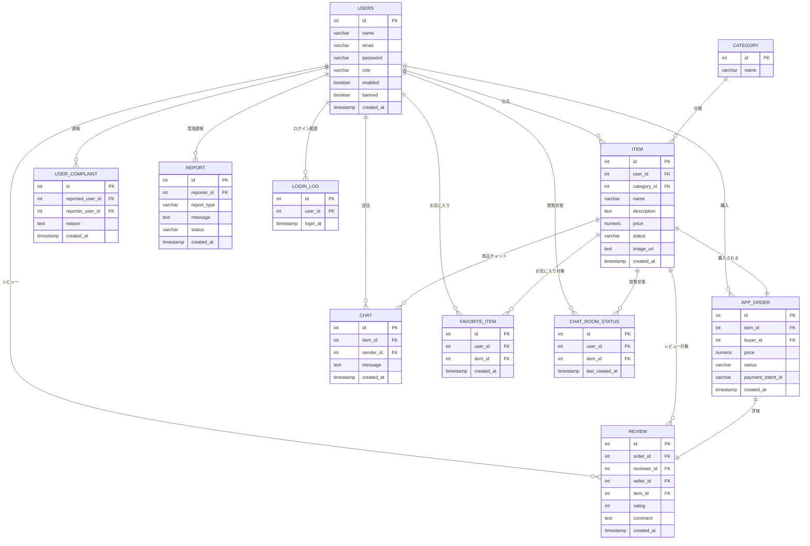

# Fleamarket
# 大見出し（H1）
## 中見出し（H2）
### 小見出し（H3）
**太字にしたいテキスト**      ← 太字
*斜体にしたいテキスト*        ← 斜体
**_太字+斜体_**               ← 太字＋斜体
- 箇条書き1
- 箇条書き2
  - サブ項目
1. 手順1
2. 手順2
```js
console.log("Hello World")
```

# 🛒 Fleamarket

Spring Boot と Thymeleaf を用いて開発した  
**フリーマーケットアプリケーション**です。

ユーザー同士が商品を出品・購入でき、  
チャット・お気に入り・レビュー・通報などの機能を備えています。

---

## 📌 プロジェクト概要

Fleamarket は、個人間で安全に売買ができることを目的とした  
Web フリマアプリケーションです。

- 出品者は商品を登録し、購入者とチャットでやり取りが可能
- Stripe による決済機能を実装
- 管理者はユーザー通報や不正ユーザーの管理が可能

---

## 🚀 機能一覧

### ユーザー機能
- ユーザー登録・ログイン（Spring Security）
- 商品の出品・編集・削除
- 商品一覧表示・検索（価格検索対応）
- お気に入り登録
- 商品購入・決済（Stripe）
- 出品者とのチャット機能（WebSocket）
- レビュー投稿
- ユーザー通報機能

### 管理者機能
- ユーザー管理（BAN / 有効・無効）
- 通報内容の確認・対応
- 商品・ユーザーの監視

### その他
- Chart.js によるデータ可視化
- Cloudinary を利用した画像アップロード
- 利用規約管理

---

## 🛠 使用技術

### フロントエンド
- Thymeleaf
- HTML / CSS
- JavaScript
- Chart.js

### バックエンド
- Java
- Spring Boot
- Spring Security
- Spring Data JPA
- WebSocket

### データベース
- Supabase（PostgreSQL）

### 外部サービス
- Stripe（決済）
- Cloudinary（画像管理）

### その他
- dotenv-java（環境変数管理）

---

## 📁 ディレクトリ構成

```
src/
└─ main/
├─ java/
│ └─ com/example/fleamarket/
│ ├─ FleamarketApplication.java
│ ├─ controller/     # リクエスト制御
│ ├─ service/        # ビジネスロジック
│ ├─ repository/     # DBアクセス
│ ├─ entity/         # エンティティ
│ ├─ security/       # 認証・認可
│ └─ config/         # 設定
└─ resources/
  ├─ templates/      # Thymeleaf
  ├─ static/         # CSS / JavaScript
  ├─ application.properties
  ├─ schema.sql
  └─ data.sql
```

---

## 🧠 ER図



---

## 🗃 テーブル設計

---

### users（ユーザー）

| カラム名 | 型 | 説明 |
|--------|----|------|
| id | SERIAL | ユーザーID（PK） |
| name | VARCHAR(50) | ユーザー名 |
| email | VARCHAR(255) | メールアドレス（ユニーク） |
| password | VARCHAR(255) | パスワード |
| role | VARCHAR(20) | 権限 |
| line_id | VARCHAR(255) | LINE連携ID |
| enabled | BOOLEAN | 有効／無効 |
| address | VARCHAR(255) | 住所 |
| last_login_at | TIMESTAMP | 最終ログイン日時 |
| terms_agreed_at | TIMESTAMP | 利用規約同意日時 |
| created_at | TIMESTAMP | 登録日時 |
| banned | BOOLEAN | BAN状態 |
| ban_reason | TEXT | BAN理由 |
| banned_at | TIMESTAMP | BAN日時 |
| banned_by_admin_id | INT | BANした管理者ID |

---

### category（カテゴリ）

| カラム名 | 型 | 説明 |
|--------|----|------|
| id | SERIAL | カテゴリID（PK） |
| name | VARCHAR(50) | カテゴリ名（ユニーク） |

---

### item（商品）

| カラム名 | 型 | 説明 |
|--------|----|------|
| id | SERIAL | 商品ID（PK） |
| user_id | INT | 出品者ID（FK） |
| name | VARCHAR(255) | 商品名 |
| description | TEXT | 商品説明 |
| price | NUMERIC(10,2) | 価格 |
| category_id | INT | カテゴリID（FK） |
| status | VARCHAR(20) | 商品状態 |
| image_url | TEXT | 商品画像URL |
| created_at | TIMESTAMP | 出品日時 |

---

### app_order（注文）

| カラム名 | 型 | 説明 |
|--------|----|------|
| id | SERIAL | 注文ID（PK） |
| item_id | INT | 商品ID（FK） |
| buyer_id | INT | 購入者ID（FK） |
| price | NUMERIC(10,2) | 購入価格 |
| status | VARCHAR(20) | 注文状態 |
| payment_intent_id | VARCHAR(128) | Stripe決済ID |
| shipping_address | VARCHAR(255) | 配送先住所 |
| created_at | TIMESTAMP | 注文日時 |

---

### chat（チャット）

| カラム名 | 型 | 説明 |
|--------|----|------|
| id | SERIAL | メッセージID（PK） |
| item_id | INT | 商品ID（FK） |
| sender_id | INT | 送信者ID（FK） |
| message | TEXT | メッセージ内容 |
| created_at | TIMESTAMP | 送信日時 |

---

### favorite_item（お気に入り）

| カラム名 | 型 | 説明 |
|--------|----|------|
| id | SERIAL | お気に入りID（PK） |
| user_id | INT | ユーザーID（FK） |
| item_id | INT | 商品ID（FK） |
| created_at | TIMESTAMP | 登録日時 |

---

### review（レビュー）

| カラム名 | 型 | 説明 |
|--------|----|------|
| id | SERIAL | レビューID（PK） |
| order_id | INT | 注文ID（FK・ユニーク） |
| reviewer_id | INT | レビュー投稿者 |
| seller_id | INT | 出品者 |
| item_id | INT | 商品ID |
| rating | INT | 評価（1〜5） |
| comment | TEXT | コメント |
| created_at | TIMESTAMP | 投稿日時 |

---

### user_complaint（ユーザー通報）

| カラム名 | 型 | 説明 |
|--------|----|------|
| id | SERIAL | 通報ID（PK） |
| reported_user_id | INT | 通報対象ユーザー |
| reporter_user_id | INT | 通報者 |
| reason | TEXT | 通報理由 |
| created_at | TIMESTAMP | 通報日時 |

---

### terms（利用規約）

| カラム名 | 型 | 説明 |
|--------|----|------|
| terms_version | SERIAL | 規約バージョン（PK） |
| terms_content | TEXT | 規約内容 |
| effective_date | DATE | 適用開始日 |

---

### report（お問い合わせ・通報）

| カラム名 | 型 | 説明 |
|--------|----|------|
| id | SERIAL | レポートID（PK） |
| reporter_id | INT | 通報者ID |
| report_type | VARCHAR(20) | 通報種別 |
| message | TEXT | 内容 |
| status | VARCHAR(20) | 対応状況 |
| created_at | TIMESTAMP | 作成日時 |

---

### login_log（ログイン履歴）

| カラム名 | 型 | 説明 |
|--------|----|------|
| id | SERIAL | ログID（PK） |
| user_id | BIGINT | ユーザーID |
| login_at | TIMESTAMP | ログイン日時 |

---

### chat_room_status（チャット閲覧状態）

| カラム名 | 型 | 説明 |
|--------|----|------|
| id | SERIAL | ID（PK） |
| user_id | BIGINT | ユーザーID |
| item_id | BIGINT | 商品ID |
| last_viewed_at | TIMESTAMP | 最終閲覧日時 |
